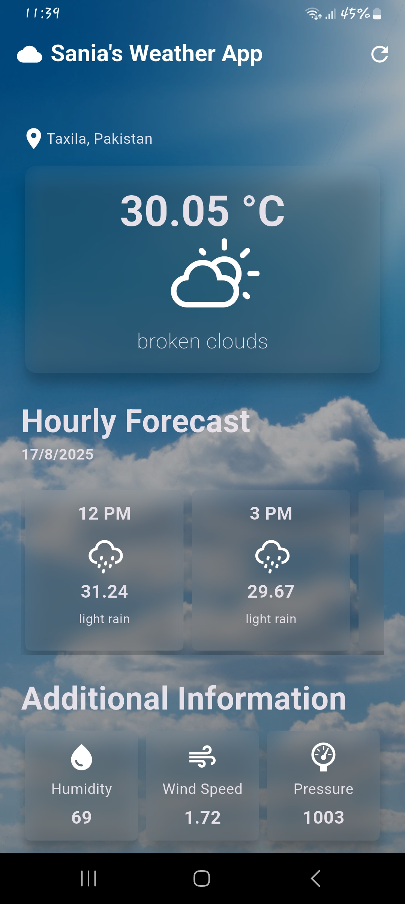
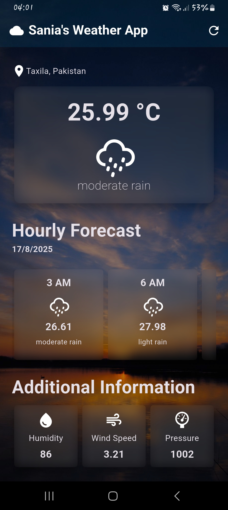
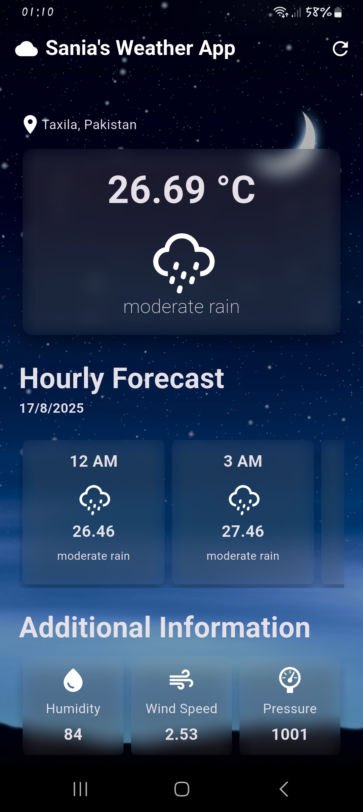

# weather_app

A simple weather forecasting app built with **Flutter** that shows current and weekly forecasts using **OpenWeather API**.  
Supports fetching user location, daily forecasts, and more.

## Screenshots
<table>
  <tr>
    <td></td>
    <td></td>
    <td></td>
  </tr>
</table>

## Features
- Get current weather by location (automatic detection) 🌍
- 5-day / 3 hour weather forecast 📅
- Clean UI with ListView (horizontal + vertical scrolls)
- Environment variables for API keys (secure 🔑)

## 🛠️ Installation

### 1. Clone the repository

```bash
git clone https://github.com/saniamirza03/flutter-weather-app.git
cd flutter-weather-app
```

### 2. Install Dependancies

```bash
flutter pub get
```

### 3. Setup environment variables

This project uses a .env file to store the API keys.
- Copy the example file

  ```bash
  cp .env.example .env
  ```
  
- Open **.env** and add your own api key.

  ```OPENWEATHER_API_KEY=your_api_key_here```

  ### 3. Run the app

  ```bash
  flutter run
  ```
